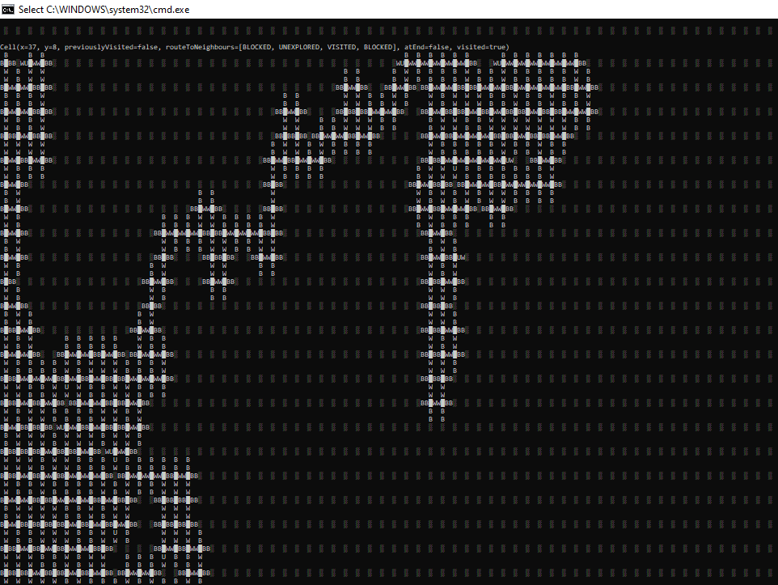
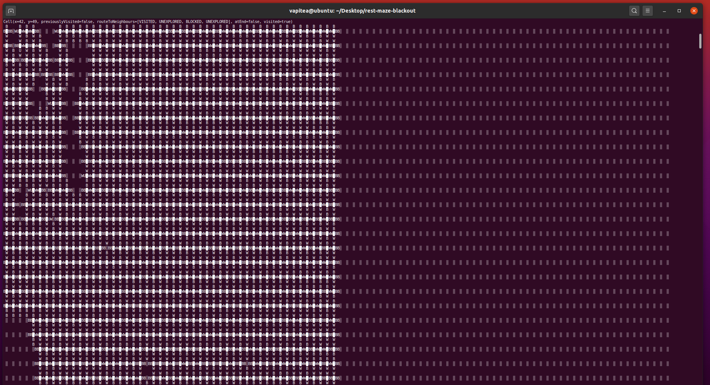

# Maze solver application

##Running the app

Running the app requires JRE 11+.

###In commandline or terminal
```
git clone https://github.com/vapitea/rest-maze-blackout.git
cd rest-maze-blackout
java -jar target/rest-maze-blackout-0.0.1-SNAPSHOT.jar
```

After running the jar file, open a browser and visit: [https://localhost:8080/mazeSolution](http://localhost:8080/mazeSolution)

The page will load for 1-5 minutes, until the solution to the maze is found. In the meantime you can check the progress on the console screen, a fontsize of 10 is recommended.

###Progress on the console

On top, the current Maze Cell is shown. 
The light rectangles are the visited cells, every cell has 4 neighbouring cells, they can be:  
* UNEXPLORED - 'U'
* BLOCKED - 'B'
* VISITED - 'W'







